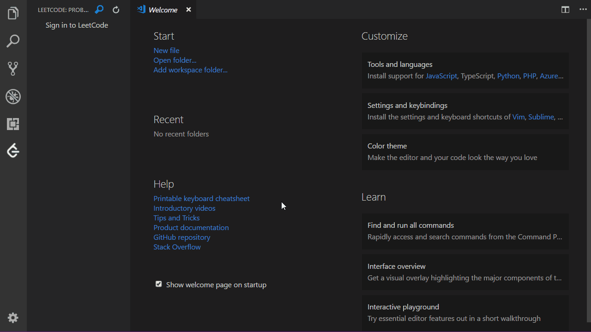
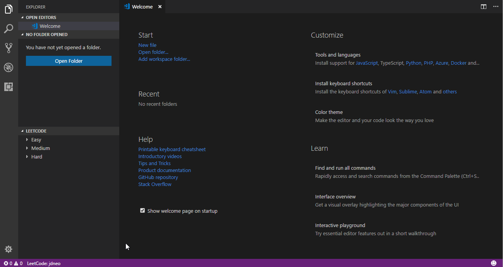
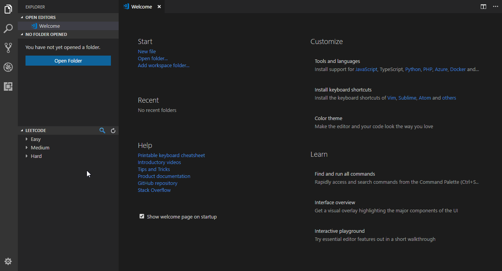
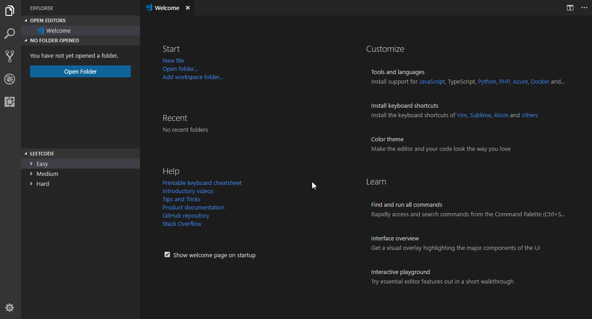
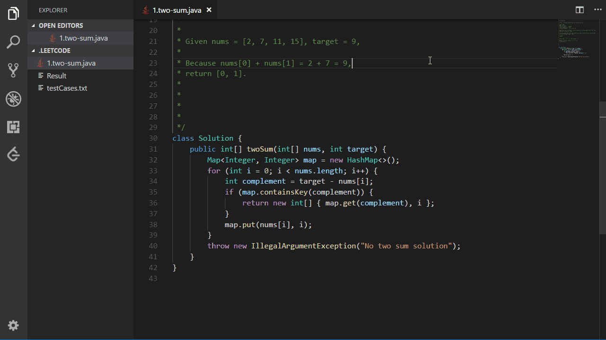

# LeetCode

Solve LeetCode problems in VS Code.
- [中文](#中文)
- [English](#english)

# English
## Requirements
- [Node.js](https://nodejs.org)
    > NOTE: Please make sure that `Node` is in your `PATH` environment variable. You can check this by running: `node -v`.

## Features
- Sign in/out to LeetCode
- Switch and create session
- Show problems in explorer
- Search problems by keywords
- Submit solutions to LeetCode

### Sign In and Sign Out

### Switch and Create Session

### Show Problems in Explorer

### Search Problems by Keywords

### Submit Solutions to LeetCode

## Known Issues:
- This extension will infer the current target problem according to the active editing file. Please do not change the file name.
- Currently, only unlocked problems will be listed.

## Release Notes

Refer to [CHANGELOG](CHANGELOG.md)

## Acknowledgement

This extension is based on [@skygragon](https://github.com/skygragon)'s [leetcode-cli](https://github.com/skygragon/leetcode-cli) open source project.

# 中文
## 运行条件
- [Node.js](https://nodejs.org)
    > 注意: 请确保`Node`在`PATH`环境变量中，您可以通过执行：`node -v`进行查看。

## 功能
- 登陆 / 登出 LeetCode
- 切换及创建 session
- 在 Explorer 中展示题目
- 根据关键字搜索题目
- 向 LeetCode 提交答案

### 登陆及登出

### 切换及创建 session

### 在 Explorer 中展示题目

### 根据关键字搜索题目

### 向 LeetCode 提交答案

## 已知问题
- 本插件会根据文件名称推测当前的目标题目，因此建议不要改变文件名。
- 本插件目前仅会显示左右已解锁的问题。

## 更新日志

请参考[更新日志](CHANGELOG.md)

## 鸣谢

本插件基于[@skygragon](https://github.com/skygragon)的[leetcode-cli](https://github.com/skygragon/leetcode-cli)开源项目制作。
